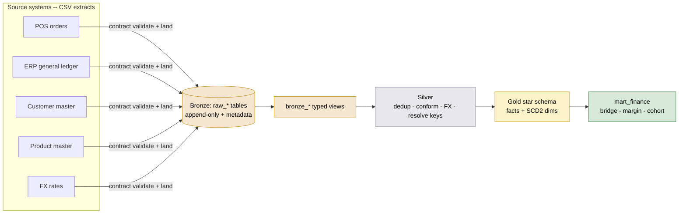
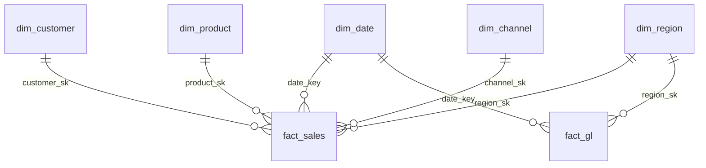

# Northwind Retail Co — PE Value-Creation Lakehouse

[](https://github.com/akhil-varsh/AI-Governed-Financial-Analytics-Platform/actions/workflows/ci.yml)

A medallion-architecture data platform that gives a private-equity sponsor's
operating partner and Northwind Retail Co's CFO a **single trusted view of
revenue, gross margin, and operating KPIs** — by region, channel, product
category, and fiscal month — so value-creation progress is visible between board
meetings.

The source data starts as disconnected CSV extracts from three systems (POS, the
ERP general ledger, and a customer/product master). This project **validates,
lands, cleans, conforms, and models** that data into a governed star schema and a
set of finance marts, with idempotent pipelines, SCD2 history, a three-tier test
suite, orchestration, and CI.

> Built as a portfolio piece for an entry-level **Data & AI Engineer** role. Every
> claim below ("it ties out", "it's idempotent", "195 tests pass") is backed by a
> command that was actually run — see [`docs/AI_WORKFLOW.md`](docs/AI_WORKFLOW.md).

---

## What this demonstrates

| Capability | Where |
| --- | --- |
| **Medallion architecture**, strictly layered | Bronze → Silver → Gold → marts |
| **Data contracts** + a Python validator that rejects bad files pre-Bronze | [`ingestion/`](ingestion/) |
| **Idempotent** ingestion (content-hash batches) and facts (incremental merge) | loader + `fact_sales` |
| **SCD2 two ways** — hand-written (customer) and a dbt snapshot (product) | [`gold/`](dbt_project/models/gold/) |
| **February fiscal calendar** | `dim_date` |
| **3-tier data quality** — source freshness/schema, model generics, 7 singular business tests (195 total) | [`tests/`](dbt_project/tests/) |
| **Warehouse-portable SQL** — BigQuery + DuckDB from one codebase | `macros/warehouse_portability.sql` |
| **Orchestration** (Dagster) + **CI** (GitHub Actions, zero cloud secrets) | [`orchestration/`](orchestration/), [`.github/`](.github/workflows/ci.yml) |
| **Full docs** — 0 blank descriptions, committed docs site, 9 ADRs, 7 "why" notes | [`docs/`](docs/) |

## Architecture



**Gold star schema:**



| Layer | Materialization | Contract |
| --- | --- | --- |
| **Bronze** | table (raw) + view (typed) | Raw landed data, append-only, + `_loaded_at`/`_source_file`/`_batch_id`/`_source_system`. No transformation. |
| **Silver** | table | Cleaned, typed, **deduplicated**, conformed. One row per business entity per grain. Nulls handled explicitly. |
| **Gold** | table | Dimensional star schema: `fact_sales`, `fact_gl`, `dim_customer` (SCD2), `dim_product` (SCD1+SCD2), `dim_date`, `dim_region`, `dim_channel`. |
| **marts** | table | `monthly_revenue_bridge`, `gross_margin_by_segment`, `customer_cohort_retention`. |

See [`docs/architecture.md`](docs/architecture.md) for the full design and
lineage.

## Stack

| Concern | Choice |
| --- | --- |
| Warehouse (documented production) | **BigQuery** (sandbox), ANSI-portable SQL |
| Execution engine (local + CI) | **DuckDB** — runs the full brief with no cloud cost ([ADR-0008](docs/decisions/0008-dual-engine-duckdb-bigquery.md)) |
| Transformation | **dbt Core** 1.9 (+ dbt_utils, dbt_date) |
| Orchestration | **Dagster** (`dagster-dbt`) |
| Ingestion / data gen | **Python 3.11**, pandas, **pydantic** contracts |
| Lint / test | **sqlfluff**, **pytest** |
| CI | **GitHub Actions** |
| Packaging | **uv** with a pinned `uv.lock` |

> **Why two engines?** BigQuery *sandbox* blocks the DML that dbt snapshots and
> incremental merge require. Rather than force billing, the same dbt SQL runs on
> DuckDB locally and in CI (vendor differences isolated in one macros file), while
> BigQuery stays the documented production target. This also makes CI
> secret-free. See [ADR-0008](docs/decisions/0008-dual-engine-duckdb-bigquery.md).

## Quickstart

```bash
# 1. Environment: installs Python 3.11, all deps, and dbt packages
make setup

# 2. Generate the reproducible synthetic dataset into data/raw/
make data

# 3a. Run the WHOLE pipeline locally on DuckDB (no cloud needed)
make rebuild        # reset -> land Bronze -> Silver -> SCD2 snapshots -> Gold -> marts

# 3b. ...or against BigQuery (documented target)
cp .env.example .env    # set your GCP project + service-account keyfile
#   then load env (see .env.example header) and:  make connection-test && make bronze && make build

# Docs, tests, lint, orchestration
make docs           # serve the dbt docs site
make test           # run all 195 data tests
make lint           # sqlfluff
make dagster        # launch the Dagster UI
```

Run `make help` for every target.

## Data quality — 195 tests, three tiers

- **Source (tier 1):** `dbt source freshness` on all 5 feeds + schema tests on the
  raw tables.
- **Model (tier 2):** `unique`, `not_null`, `relationships`, `accepted_values` on
  every model (referential integrity → zero orphan FKs).
- **Business (tier 3):** 7 singular tests — GL↔sales tie-out (within a $1
  tolerance), no overlapping SCD2 windows, single current version, net-revenue
  sign, margin range, fact-vs-source row count (±10%), no orphan FKs.

## Verified results

Built and tested on DuckDB (mirrors BigQuery):

- **GL ties to sales revenue** to within **$0.12 on $173.06M** (a rounding-convention
  difference — see [`docs/why/phase3.md`](docs/why/phase3.md)).
- **Gross margin 37.8%**; net revenue grows **$3.7M → $6.0M / month** over three years.
- **SCD2 correct:** 3 clean customer histories, 23 versioned products; a
  point-in-time join attributes each sale to the segment *as-was*.
- **Idempotent:** re-running the loader skips loaded batches; re-running
  `fact_sales` holds 200,000 rows / 200,000 unique.
- **Docs:** 0 blank descriptions across 20 models + 5 sources (verified against the
  catalog).

## Repository layout

```
northwind-lakehouse/
  README.md
  docs/            architecture, data dictionary, AI workflow, ADRs, per-phase "why" notes, dbt docs site
  ingestion/       data contracts (YAML), validator, Bronze loader, unit tests
  dbt_project/     models (bronze/silver/gold/marts), snapshots, tests, macros, seeds
  orchestration/   Dagster assets + schedule
  scripts/         synthetic data generator + helpers
  .github/         CI workflow
  Makefile         setup / data / rebuild / build / test / docs / dagster / ...
```

## Documentation

- [`docs/architecture.md`](docs/architecture.md) — full design + lineage
- [`docs/data_dictionary.md`](docs/data_dictionary.md) — every consumption table + column
- [`docs/decisions/`](docs/decisions/) — 9 Architecture Decision Records ([index](docs/decisions/README.md))
- [`docs/why/`](docs/why/) — per-phase "why" notes, written to be defended in an interview
- [`docs/dbt_docs/`](docs/dbt_docs/) — committed dbt docs site (open `index.html`)
- [`docs/AI_WORKFLOW.md`](docs/AI_WORKFLOW.md) — how this was built with AI, and what stays human

## Data

The dataset is **synthetic and reproducible** (`scripts/generate_synthetic_data.py`,
seeded): 3 fiscal years, ~200k order lines, ~15k customers, ~800 products, 4
regions, 3 channels, and a GL extract that **ties out** to sales net revenue. It
carries deliberately injected data problems (duplicates, dirty region spellings,
null customer ids, returns, mixed currency, SCD2 changes) for the Silver layer to
resolve. See [`data/README.md`](data/README.md).
