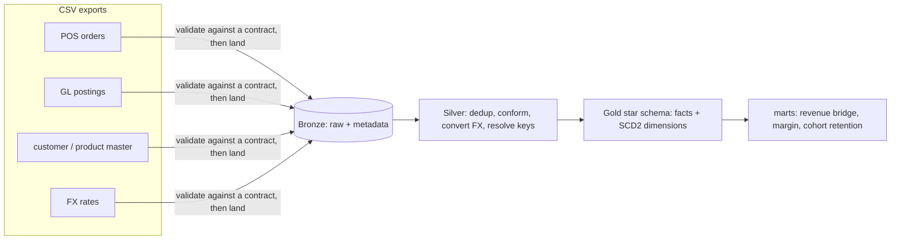

<div align="center">

# 🏛️ AI-Governed Financial Analytics Platform

**Let a CFO ask a finance data warehouse questions in plain English — without ever getting a made-up number, a dropped table, or an unlogged query back.**

A tested dbt + DuckDB star schema, wrapped in a read-only MCP server that puts a governance layer between an LLM and the numbers.

[](https://github.com/akhil-varsh/AI-Governed-Financial-Analytics-Platform/actions/workflows/ci.yml)
&nbsp;
&nbsp;
&nbsp;
&nbsp;


<sub><b>Live in Claude Desktop</b> — the model calls the governed <code>query_metric</code> tool for net revenue by region, then reconciles the $173M total to the general ledger and lands within <b>$0.12</b>. It never wrote the revenue formula and never touched a raw connection; the server did.</sub>

</div>

---

Two things live in this repo, and they're meant to be read together:

- **A finance data warehouse** (`dbt_project/`, `ingestion/`, `orchestration/`) —
  the pipeline that turns three messy CSV exports into a clean, tested star schema
  with revenue and gross-margin marts.
- **An MCP server on top of it** (`mcp-server/`) — a read-only, governed way for a
  non-technical person to ask that warehouse questions in plain English through
  Claude Desktop, without being able to break anything or get a made-up number
  back.

The setup is a private-equity sponsor that owns *Northwind Retail Co*, a
mid-market specialty retailer. Between board meetings the operating partner and
the CFO want to know how revenue and gross margin are moving by region, channel,
and product category. Right now that data is scattered across a point-of-sale
export, the ERP general ledger, and a customer/product master, none of which
agree on spelling, keys, or currency. The warehouse reconciles them; the MCP
server makes the result answerable in a sentence.

It's a portfolio project, so the data is synthetic and the whole thing runs on a
laptop with no cloud account. The parts that would actually matter in production —
the reconciliation, the slowly-changing history, the SQL guards, the audit trail —
are real, and there are tests to prove it.

## The warehouse

The pipeline is a fairly standard medallion setup (Bronze → Silver → Gold →
marts), but a few things in it are worth calling out.



Nothing gets into Bronze until it passes a data contract. Each feed has a small
YAML schema (required columns, types, value ranges) and a Python validator that
rejects a bad file at the door rather than letting it quietly poison everything
downstream. The trick is that the contract has to *allow* the messiness the Silver
layer is built to clean — duplicate rows, inconsistent region spellings, missing
customer IDs, negative-quantity returns, two currencies — while still catching
genuine corruption. (Writing those contracts is where I found my first real bug:
one required `discount_amount >= 0`, which is wrong, because a return legitimately
produces a negative discount.)

Silver does the cleaning: it dedups the ~2% duplicate order lines, maps 20
spelling variants of four regions back to canonical values, resolves null customer
IDs to an explicit `UNKNOWN` member instead of dropping the revenue, and converts
EUR lines to USD. Gold is a Kimball star — two facts (`fact_sales` at order-line
grain, `fact_gl` at posting grain) and conformed dimensions.

Two of those dimensions carry slowly-changing history, done two different ways on
purpose so I can talk about the trade-off: `dim_customer` is a hand-written SCD2
with business-effective dates (so a sale is attributed to the segment the customer
was in *at the time*), and `dim_product` uses a dbt snapshot. `dim_date` runs a
February fiscal year, because that's the kind of detail that quietly breaks
"by quarter" reporting if you assume January.

**One decision that shaped everything:** BigQuery is the documented production
warehouse, but the pipeline actually runs on DuckDB, both locally and in CI. The
free BigQuery sandbox blocks the DML that dbt snapshots and incremental `merge`
need, and I didn't want to require a billing account or stash cloud credentials in
CI. So the model SQL is written once, ANSI-clean, with the handful of
vendor-specific functions behind a single macros file, and it runs on either
engine. That's also why CI is fast and needs no secrets. The full reasoning is in
[ADR-0008](docs/decisions/0008-dual-engine-duckdb-bigquery.md).

Because I generated the GL *from* the sales facts, the two reconcile: summed net
revenue ties to the GL revenue account within **$0.12 on $173M**. That gap isn't
sloppiness — it's a rounding-convention difference (NumPy rounds half-to-even, the
warehouse rounds half-away), which turned out to be a good thing to understand and
is written up in [docs/why/phase3.md](docs/why/phase3.md). Gross margin lands
around 37.8%, and there are **195 tests** across three tiers: source freshness and
schema checks, generic model tests (uniqueness, not-null, referential integrity),
and seven hand-written business tests — the tie-out, no overlapping SCD2 windows,
margin bounds, fact-vs-source row counts, and so on.

Dagster orchestrates the whole thing as one scheduled job, and GitHub Actions runs
lint → build → test on every push.

## The MCP server

This is the part I care most about. The premise: you want a CFO to be able to ask
the warehouse questions through Claude Desktop, but you can't just hand an LLM a
SQL connection to a finance database and hope. The interesting work isn't "get the
model to write SQL" — it's the governance that makes doing so safe.

It exposes read-only tools over the [Model Context Protocol](https://modelcontextprotocol.io)
(built on the official Anthropic MCP SDK), reading the Gold/marts tables exported
into a local read-only DuckDB. Three ideas do most of the work:

*A semantic layer, so the model can't invent a wrong number.* Metrics like
`net_revenue` and `gross_margin_pct` are defined in a YAML catalogue — the SQL
expression, the allowed dimensions and filters, the fiscal grain, a plain-English
definition, an owner. The model asks for a *metric* by name and gets to slice it
by region or segment; it never writes the revenue formula, so it can't sum the
wrong column or double-count a customer whose segment changed mid-year. The
compiler validates the dimension/filter names against the catalogue and binds
filter *values* as parameters, so a value like `West'; DROP TABLE ...` is an inert
string that matches no region.

*Five layers of defense for the raw-SQL escape hatch.* There's still an
`execute_sql` tool for the ad-hoc questions a metric can't answer, and it's
wrapped in: a read-only engine; a syntactic guard (single statement, must start
with SELECT/WITH, a keyword blocklist, a forced row limit); a semantic guard that
parses the query to an AST and refuses any table outside the `gold`/`marts`
allowlist; the protocol's read-only annotations; and an audit log. I built the
guards test-first — the adversarial suite (stacked statements, comment-obfuscated
DDL, `read_csv` path traversal, `COPY … TO` exfiltration, unicode tricks around
the SELECT check) was written and watched *succeed* against an unguarded stub,
then the guards went in until all 25 attacks turned into specific, logged
denials.

*An audit trail.* Every tool call — allowed or denied — is one structured JSON
line: who called what, the generated SQL, rows returned, latency, and the
allow/deny decision with its reason. It goes to a file and to stderr (not stdout,
which on a stdio MCP server is the protocol channel — a small thing that breaks the
whole connection if you get it wrong).

There's a full [threat model](mcp-server/docs/THREAT_MODEL.md) that lists what an
attacker could try and which layer stops it, and a `make demo` that replays a
scripted CFO conversation ending with two blocked attacks.

## Running it

The two subprojects have separate environments — the lakehouse pulls a newer
`sqlglot` through dbt than the MCP server can use, so they can't share a venv.
Each has its own `Makefile`.

```bash
# --- the warehouse (repo root) ---
make setup            # Python 3.11 + deps via uv
make data             # generate the synthetic dataset
make rebuild          # run the whole pipeline locally on DuckDB
make test             # 195 data tests

# --- the MCP server ---
cd mcp-server
make setup
make export           # pull the Gold/marts tables from ../northwind.duckdb
make test             # 62 tests
make demo             # replay the scripted CFO conversation
```

To use the MCP server from Claude Desktop, run `make export` once, then copy the
block from `mcp-server/claude_desktop_config.example.json` into your Claude Desktop
config and restart. You'll get seven tools; ask it "what was net revenue by
region?" and watch it call `query_metric`.

## What's real and what isn't

Worth being upfront about, since it's a portfolio piece:

- The **data is synthetic**, generated by a seeded script. It's deliberately
  realistic (the GL ties to sales, the injected data problems are the ones you
  actually hit), but it's not a real company.
- **BigQuery is wired up and documented** but the day-to-day runs on DuckDB, for
  the reasons above. The connection to BigQuery works; I've verified Bronze and
  Silver against it.
- The MCP server's warehouse is a **read-only snapshot**. There's no row- or
  column-level security (anyone who can reach it can read any governed table), no
  auth at the MCP layer, and no multi-tenancy. Those are real next steps, called
  out honestly in the threat model rather than pretended away.

## Layout

```
northwind-lakehouse/          (this repo)
  dbt_project/                models (bronze/silver/gold/marts), snapshots, tests, macros
  ingestion/                  data contracts + validator + Bronze loader
  orchestration/              Dagster job + schedule
  scripts/                    synthetic data generator
  docs/                       architecture, data dictionary, ADRs, per-phase "why" notes
  northwind.duckdb            local warehouse (the MCP server exports from this)
  mcp-server/                 the governed MCP access layer, on top of the Gold schema
```

## Where to read more

- [`docs/architecture.md`](docs/architecture.md) — the warehouse design and lineage
- [`docs/decisions/`](docs/decisions/) — the ADRs (why DuckDB alongside BigQuery, why two SCD2 approaches, and so on)
- [`docs/why/`](docs/why/) and [`mcp-server/docs/why/`](mcp-server/docs/why/) — per-phase notes written the way I'd explain them in an interview
- [`mcp-server/README.md`](mcp-server/README.md) — the MCP server on its own terms
- [`docs/AI_WORKFLOW.md`](docs/AI_WORKFLOW.md) — how I used AI to build this, and where the judgement stayed mine
