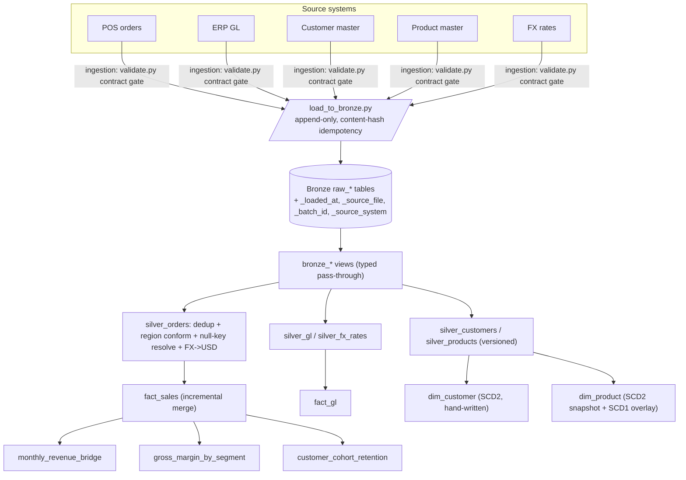
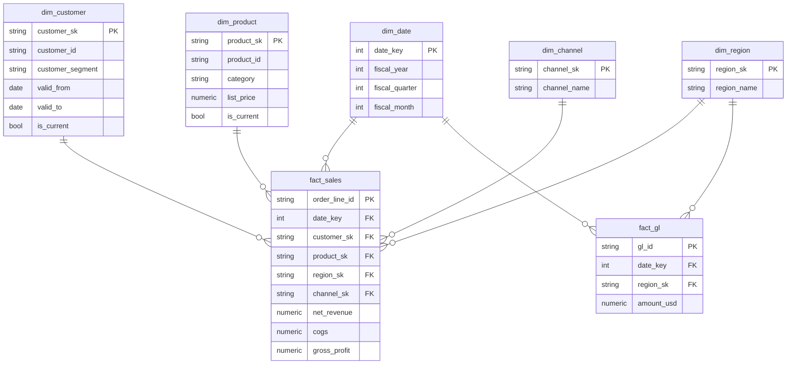

# Architecture

## Business problem

A PE sponsor owns **Northwind Retail Co**, a mid-market specialty retailer. The
sponsor's operating partner and Northwind's CFO need one trusted view of
**revenue, gross margin, and operating KPIs** by region, channel, product
category, and fiscal month, to track value-creation between board meetings.

The data lives in disconnected CSV extracts from the POS system, the ERP general
ledger, and customer/product masters (plus an FX feed). None agree on keys,
spelling, or currency. This platform reconciles them into a governed star schema
and finance marts.

## Medallion data flow

| Layer | Materialization | Contract |
| ----- | --------------- | -------- |
| **Bronze** | raw tables (Python) + typed views (dbt) | Raw landed data, **append-only**, + ingestion metadata. No transformation. |
| **Silver** | table | Cleaned, typed, **deduplicated**, conformed; one row per business entity per grain; nulls handled explicitly; currency conformed to USD. |
| **Gold** | table | Dimensional **star schema** (facts + conformed dimensions, incl. SCD2). |
| **marts** | table | Business-facing finance models on top of Gold. |

Each layer lands in its own schema/dataset (`<target>_raw`, `_bronze`, `_silver`,
`_gold`, `_marts`) via the custom `generate_schema_name` macro, so the warehouse
is browsable by layer and read access can be granted to `marts` alone.
See [ADR-0002](decisions/0002-medallion-architecture.md).

## Gold star schema

- **`fact_sales`** — grain: order line. Incremental **merge** on `order_line_id`
  ([ADR-0007](decisions/0007-gold-star-schema-and-scd2.md)). `dim_customer` is
  joined **point-in-time** (segment as-was on the order date); `dim_product` on
  its current version.
- **`fact_gl`** — grain: GL posting; measure `amount_usd`.
- **`dim_customer`** — hand-written **SCD2** with business-effective validity
  windows; **`dim_product`** — dbt **snapshot** SCD2 (category, list_price) + SCD1
  overlay on description. Two approaches, two write-ups
  ([ADR-0007](decisions/0007-gold-star-schema-and-scd2.md)).
- **`dim_date`** — generated calendar with a **February fiscal year**
  (`fiscal_year_start_month` var).

## Reliability guarantees

- **Idempotency** — content-hash batch ids make ingestion re-runnable; the
  incremental `merge` on `fact_sales` makes fact rebuilds idempotent (verified:
  200,000 rows / 200,000 unique on re-run).
- **SCD2** — explicit `valid_from` / `valid_to` / `is_current`, one dimension via
  dbt snapshot, one hand-written.
- **Data quality in three tiers** — source freshness/schema, model generics,
  business singular tests (**195 tests**).
- **Data contracts** — YAML schema per feed + a Python validator that rejects a
  bad file *before* Bronze ([ADR-0005](decisions/0005-data-contracts-and-bronze-landing.md)).
- **Reconciliation** — the GL revenue account ties to `fact_sales` net revenue
  within a $1 materiality tolerance ($0.12 actual).

## Portability & dual engine

All model SQL is ANSI-compliant; every vendor-specific function lives behind a
macro in `dbt_project/macros/warehouse_portability.sql`. This is what lets the
same models run on **BigQuery** (documented production target) and **DuckDB**
(local + CI execution), and would make a Snowflake migration a small, auditable
diff. See [ADR-0003](decisions/0003-bigquery-portable-sql.md) and
[ADR-0008](decisions/0008-dual-engine-duckdb-bigquery.md).

## Orchestration & CI

A Dagster job (`orchestration/definitions.py`) lands Bronze then runs
`dbt build`, wired so the ingestion asset produces the dbt source assets (the DAG
links automatically), on a daily schedule. GitHub Actions runs the whole thing on
DuckDB with no cloud secrets, failing on any lint or test failure.
See [ADR-0009](decisions/0009-orchestration-and-ci.md).
