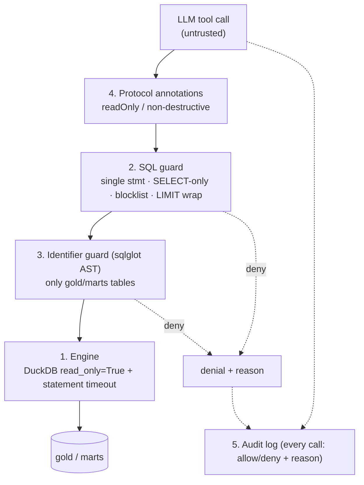

# CFO MCP Server

A **governed, read-only [MCP](https://modelcontextprotocol.io) server** over a
finance data warehouse. It lets a CFO, an operating partner, or a deal-team member
ask questions in natural language — *"what was gross margin by segment last fiscal
year?"* — through Claude Desktop or Cursor, and get answers from **read-only,
governed, audited** access to the warehouse.

> **The point of this project is not "an LLM writes SQL."** It's the **governance
> layer** that makes letting an LLM near a finance warehouse safe: a semantic
> metric catalogue so the model can't invent a wrong revenue figure, five layers
> of defense-in-depth so it can't write/exfiltrate/escape, and a full audit trail
> so every call is accountable.

Built on the official Anthropic **MCP Python SDK** (`mcp.server.fastmcp.FastMCP`),
over the parent [Northwind lakehouse](..)'s Gold/marts tables exported into a
local read-only DuckDB — so the demo runs with **zero cloud cost and zero
credentials**. This project lives inside the lakehouse repo (`mcp-server/`) as the
governed-access layer on top of its Gold star schema.

---

## What it exposes

**Tools** (all read-only, all annotated as such at the protocol level):

| Tool | Purpose |
| ---- | ------- |
| `list_tables` | Discover the governed tables (row counts + descriptions). |
| `get_schema` | Columns, types, descriptions, sample values for one table. |
| `preview_table` | Up to 50 sample rows. |
| **`list_metrics`** | The governed metric catalogue. |
| **`query_metric`** | **Preferred path** — run a governed metric sliced by dimensions / filters / time grain. |
| `execute_sql` | Raw read-only SELECT escape hatch, heavily guarded, last resort. |
| `explain_query` | Query plan + estimated cost **without running** the query. |

**Resources:** `schema://tables` (data dictionary), `metrics://catalogue`
(semantic layer), and the design/threat docs.

## The semantic layer (why this project is good)

Metrics are defined in [`metrics.yaml`](src/cfo_mcp/semantic/metrics.yaml) — not in
code — each with its SQL expression, base table, allowed dimensions/filters,
default time grain, plain-English definition, and owner. `query_metric` compiles
`metric + dimensions + filters + time_grain` into **safe, parameterised SQL**:

- dimension/filter **keys** are validated against the metric's allowlist (an
  unknown key is denied, not ignored);
- filter **values** are bound as parameters (`?`), never concatenated — an
  injection payload in a value is an inert literal;
- the **formula** comes from the reviewed YAML, so the model asks for a *metric*
  and cannot fabricate a wrong revenue definition.

It also encodes correctness the model would otherwise get wrong: point-in-time
SCD2 segment attribution, distinct-customer counting by natural key, and the
February fiscal calendar. See [`docs/why/phase5.md`](docs/why/phase5.md).

## Defense in depth (five layers)



| # | Layer | Stops |
| - | ----- | ----- |
| 1 | Engine `read_only=True` + timeout | Writes; runaway queries |
| 2 | SQL guard (regex + blocklist + wrap) | Stacked statements, DDL/DML, `read_csv`/`COPY`/`ATTACH`, over-large results |
| 3 | Identifier guard (sqlglot AST) | Reads outside `gold`/`marts`; unknown tables |
| 4 | Protocol annotations | (advisory) signals read-only to the client |
| 5 | Audit log | (detective) records every allow/deny with reason |

The full attack→defense matrix is in
[`docs/THREAT_MODEL.md`](docs/THREAT_MODEL.md). Every attack has a test —
`tests/test_guards_adversarial.py` was written **first** (watch the attacks
succeed), then the guards were built until all 25 flip to a denial.

## Quickstart

```bash
make setup      # install deps (Python 3.11, uv)
make export     # build data/warehouse.duckdb from the lakehouse Gold/marts
make test       # 62 tests
make demo       # replay the scripted CFO conversation (great for a GIF)
make audit      # summarise the audit log
```

### Connect to Claude Desktop

1. `make export` (so `data/warehouse.duckdb` exists).
2. Copy the `cfo-mcp` block from
   [`claude_desktop_config.example.json`](claude_desktop_config.example.json) into
   your Claude Desktop config (adjust the path):
   - macOS: `~/Library/Application Support/Claude/claude_desktop_config.json`
   - Windows: `%APPDATA%\Claude\claude_desktop_config.json`
3. Restart Claude Desktop. You'll have the seven tools above — ask *"what was net
   revenue by region?"* and watch it call `query_metric`.

Or run the browser-based MCP Inspector: `make inspect`.

## Repository layout

```
mcp-server/
  src/cfo_mcp/
    server.py           FastMCP app + tool/resource registration
    config.py           settings (allowed schemas, limits, paths)
    adapters/           base.py (interface) + duckdb.py (read-only) [+ snowflake stub]
    guards/             sql_guard.py, identifier_guard.py, pipeline.py
    semantic/           metrics.yaml, model.py, compiler.py, catalogue.py
    audit.py            structured JSON audit logging
    dictionary.py       data-dictionary markdown
  scripts/              export_gold.py, analyze_audit.py, demo.py
  tests/                test_tools, test_guards_adversarial, test_metrics, test_audit, test_smoke
  docs/                 THREAT_MODEL.md, AI_WORKFLOW.md, decisions/ (ADRs), why/ (per-phase notes)
  claude_desktop_config.example.json
```

## Documentation

- [`docs/THREAT_MODEL.md`](docs/THREAT_MODEL.md) — attacks and which layer stops each
- [`docs/decisions/`](docs/decisions/) — ADRs ([index](docs/decisions/README.md))
- [`docs/why/`](docs/why/) — per-phase "why" notes, interview-style
- [`docs/AI_WORKFLOW.md`](docs/AI_WORKFLOW.md) — how this was built with AI, and what stays human

## Stack

Python 3.11 · **`mcp`** (official SDK, FastMCP) · **DuckDB** (read-only) ·
**pydantic** · **sqlglot** (AST guard) · **structlog** (audit) · **pytest**.
Pluggable adapter interface so a Snowflake/BigQuery backend is a drop-in.
